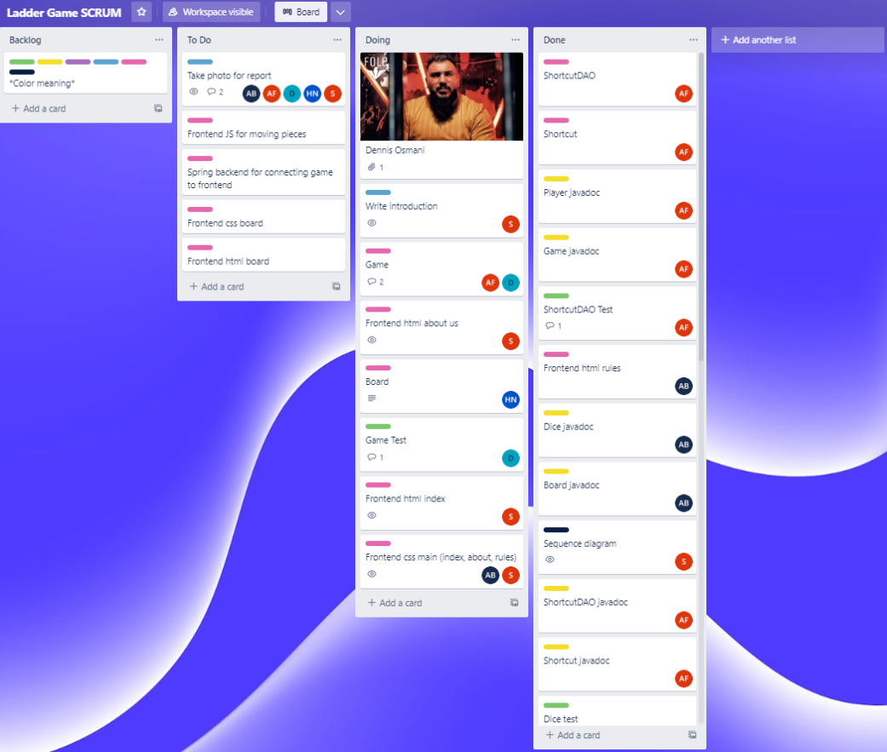

\newpage
# Introduction
In this assignment we were assigned to model and program the traditional Indian board game "snakes and ladders".  
This assignment was made to help us practice the following things:  

- Practice developing a program from idea to product.  
- Practice understanding a requirements specification and creating a model that matches the requirements.  
- Practice using object-oriented principles and design patterns to create a solution.  
  
The report will contain a detailed explanation for our design choices by referencing to GRASP, our workflow, the different diagrams and models made, and some screenshots of our code and project structure.

# Workflow
Because we're 5 people working on the same project we wanted to avoid the issue of several people working on the same task.   
To fix this issue we used a online kanban-board with trello.com, where everyone can assign themselfs to the tasks they are currently doing.

# Diagrams

**Sequence diagram**
To illustrate the interaction between the player and the program we drew a sequence diagram which can be seen below.

1. The first interaction between the user and the program is a dialogue box asking the user how many players will be in the game. 
2. When the user has entered the amount of players, the system will try to instanciate a new game() object the amount of players.
3. The player then sends a request to start the game.
4. The program will throw a new dice roll for each iteration and update the game accordingly, until all players but one has finished the game.

**Domain model**

